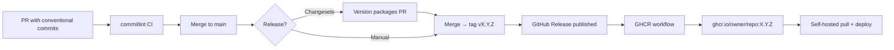

# GHCR publishing, versioning, and conventional commits

Research date: 2026-08-31. Primary sources only.

Recommendations below target a **self-hosted Next.js app** (single deployable image, not an npm library). A pnpm monorepo layout is assumed if the repo grows beyond one app package.

---

## 1. Versioning patterns

| Pattern                    | How version is chosen                                | Typical trigger                            | Best fit                                      |
| -------------------------- | ---------------------------------------------------- | ------------------------------------------ | --------------------------------------------- |
| **Git tags**               | Human or bot tags `v1.2.3` (SemVer)                  | `on: push: tags: ['v*']` or GitHub Release | Simple apps; explicit release gate            |
| **`package.json` version** | Bumped manually or by tooling                        | Read in Dockerfile/CI; tag may mirror it   | App version baked into UI/build metadata      |
| **semantic-release**       | Inferred from Conventional Commits on release branch | Push to `main` in CI                       | Single package; fully automated, no review PR |
| **Changesets**             | Author adds `.changeset/*.md` with bump type         | `changeset version` → release PR → merge   | Monorepos; intentional, reviewable releases   |

### Git tags

- Tags are the usual **immutable release marker** for container images.
- SemVer tags are commonly prefixed: `v1.2.3` (semantic-release default `tagFormat`) or unprefixed `1.2.3`.
- `docker/metadata-action` semver rules expect a `v`-prefixed tag by default (`pattern=v{{version}}`); adjust `pattern` if tags omit `v`.

**Sources:** [semantic-release configuration](https://semantic-release.gitbook.io/semantic-release/usage/configuration), [Conventional Commits → SemVer mapping](https://www.conventionalcommits.org/en/v1.0.0/)

### `package.json` version

- For a Next.js app, `version` is often the **display/build version** (health endpoint, footer, Sentry release).
- Keep it in sync with the git tag used for Docker (`1.2.3` in package.json ↔ tag `v1.2.3`).
- Do not rely on `package.json` alone as the release trigger unless CI reads it and creates/pushes a matching tag (unusual for apps; prefer tag or release as trigger).

### semantic-release

- Analyzes commits since the last tag; bumps SemVer; generates notes; creates git tag + GitHub Release; can run publish hooks.
- **Requires** [Conventional Commits](https://www.conventionalcommits.org/en/v1.0.0/) (`feat:` → minor, `fix:` → patch, `BREAKING CHANGE` / `feat!:` → major).
- Default plugins include `@semantic-release/github` (release + tag). Use `@semantic-release/exec` to run a custom Docker publish step after version is computed.
- Protect `main`: anyone who can push can release.
- **Single-package bias:** monorepo support needs extra plugins (`semantic-release-monorepo`); a shared commit can bump unrelated packages if not scoped carefully.

**Sources:** [semantic-release configuration](https://semantic-release.gitbook.io/semantic-release/usage/configuration)

### Changesets

- Contributors run `pnpm changeset` and add a markdown file describing bump type (`patch` / `minor` / `major`) and changelog text.
- `pnpm changeset version` consumes changesets, bumps `package.json` versions, updates changelogs.
- `pnpm changeset publish` creates git tags (`vX.Y.Z` for single-package repos, `pkg@X.Y.Z` in monorepos) and publishes to npm if configured.
- **Not every change needs a changeset** (docs-only, refactors with no release) — do not block PRs without one.
- [`changesets/action`](https://github.com/changesets/action) automates: open/update a “Version packages” PR; on merge, version + tag (+ optional npm publish).
- **Docker-only apps:** use Changesets for **versioning + tagging only**; a separate workflow builds/pushes the image when tags appear or when `package.json` version changes on `main`.

**Sources:** [Changesets getting started](https://changesets.dev/guide/getting-started), [Versioning and publishing](https://changesets.dev/guide/versioning-and-publishing), [changesets/action](https://github.com/changesets/action)

### Recommendation (self-hosted Next.js app)

| Repo shape                                | Suggested approach                                                                                                                                                                   |
| ----------------------------------------- | ------------------------------------------------------------------------------------------------------------------------------------------------------------------------------------ |
| **Single app**                            | **Git tag + GitHub Release** (manual or Changesets release PR). Add **commitlint** for readable history; skip full semantic-release unless you want zero-touch releases from `main`. |
| **pnpm monorepo** (app + shared packages) | **Changesets** at repo root: explicit bumps per package, release PR for review. Docker workflow triggers on tag or `release: published`.                                             |
| **Fully automated single app**            | **semantic-release** on `main` + Conventional Commits + Docker publish hook. Higher operational risk; protect branch and enforce commitlint in CI.                                   |

**Principle:** separate **versioning** (who decides the number) from **image publish** (build on tag/release). One workflow should not build production images on every push to `main`.

---

## 2. GitHub Actions: build on tag or release

### Trigger options

| Trigger                       | When it runs           | Notes                                                                                                                                                              |
| ----------------------------- | ---------------------- | ------------------------------------------------------------------------------------------------------------------------------------------------------------------ |
| `release: types: [published]` | GitHub Release created | [GitHub docs recommend this](https://docs.github.com/en/actions/tutorials/publish-packages/publish-docker-images) for registry publish; tag comes from the release |
| `push: tags: ['v*']`          | Tag pushed             | Good when versioning tool pushes tags without a GitHub Release                                                                                                     |
| `push: branches: [release]`   | Branch push            | GitHub’s alternate GHCR example; less common for SemVer apps                                                                                                       |

Prefer **`release: published`** or **`push: tags`** for production images. Use `workflow_dispatch` for manual rebuilds.

### Minimal GHCR workflow (release-triggered)

```yaml
name: Publish Docker image

on:
  release:
    types: [published]
  # Alternative: push: tags: ['v*']

env:
  REGISTRY: ghcr.io
  # github.repository is owner/repo; must be lowercase for GHCR
  IMAGE_NAME: ${{ github.repository }}

jobs:
  build-and-push:
    runs-on: ubuntu-latest
    permissions:
      contents: read
      packages: write
      attestations: write
      id-token: write
    steps:
      - uses: actions/checkout@v4

      - uses: docker/setup-buildx-action@v3

      - uses: docker/login-action@v3
        with:
          registry: ${{ env.REGISTRY }}
          username: ${{ github.actor }}
          password: ${{ secrets.GITHUB_TOKEN }}

      - name: Lowercase image name
        run: echo "IMAGE=${{ env.REGISTRY }}/$(echo '${{ github.repository }}' | tr '[:upper:]' '[:lower:]')" >> $GITHUB_ENV

      - id: meta
        uses: docker/metadata-action@v5
        with:
          images: ${{ env.IMAGE }}
          tags: |
            type=semver,pattern={{version}}
            type=semver,pattern={{major}}.{{minor}}
            type=semver,pattern={{major}}
            type=raw,value=latest,enable=${{ !github.event.release.prerelease }}
          labels: |
            org.opencontainers.image.source=${{ github.repositoryUrl }}

      - id: push
        uses: docker/build-push-action@v6
        with:
          context: .
          file: ./Dockerfile
          push: true
          tags: ${{ steps.meta.outputs.tags }}
          labels: ${{ steps.meta.outputs.labels }}
          cache-from: type=gha
          cache-to: type=gha,mode=max

      - uses: actions/attest-build-provenance@v2
        with:
          subject-name: ${{ env.IMAGE }}
          subject-digest: ${{ steps.push.outputs.digest }}
          push-to-registry: true
```

### Required details

- **`permissions.packages: write`** — `GITHUB_TOKEN` can publish packages for the workflow repo ([GHCR auth in Actions](https://docs.github.com/en/packages/working-with-a-github-packages-registry/working-with-the-container-registry#authenticating-in-a-github-actions-workflow)).
- **Login:** `registry: ghcr.io`, `username: ${{ github.actor }}`, `password: ${{ secrets.GITHUB_TOKEN }}`.
- **Publishing from a workflow auto-links** the package to the repository ([GHCR docs](https://docs.github.com/en/packages/working-with-a-github-packages-registry/working-with-the-container-registry#pushing-container-images)).
- **`docker/metadata-action`** derives SemVer tags from the release/tag ref.
- **BuildKit cache** (`type=gha`) speeds Next.js multi-stage builds.
- **Artifact attestation** (optional) improves supply-chain provenance ([GitHub publish tutorial](https://docs.github.com/en/actions/tutorials/publish-packages/publish-docker-images)).

### Wiring Changesets → Docker

1. Merge “Version packages” PR → Changesets bumps `package.json`, updates changelog, pushes tag (e.g. `v1.2.3`).
2. Create GitHub Release from that tag (Changesets action can do this) **or** rely on tag-push trigger.
3. Docker workflow runs on `release: published` or `push: tags: ['v*']`.

### Wiring semantic-release → Docker

- Add `@semantic-release/exec` (or a dedicated job triggered on `release: published`) to build/push after semantic-release creates the release.
- Or use a single workflow with `needs:` — semantic-release job outputs version; Docker job uses that tag.

---

## 3. commitlint + Husky (pnpm monorepo)

Install at the **repo root** so all packages share one commit policy.

### Dependencies (root)

```bash
pnpm add -D husky @commitlint/cli @commitlint/config-conventional lint-staged
pnpm exec husky init
```

### Root `package.json` (excerpt)

```json
{
  "scripts": {
    "prepare": "husky"
  },
  "lint-staged": {
    "apps/web/**/*.{ts,tsx,js,jsx,mjs}": ["eslint --fix", "prettier --write"],
    "packages/**/*.{ts,tsx}": ["eslint --fix", "prettier --write"]
  }
}
```

Adjust paths to match the monorepo layout (`apps/web`, `packages/*`, etc.).

### `commitlint.config.mjs` (root)

```js
export default {
  extends: ["@commitlint/config-conventional"],
  rules: {
    "scope-enum": [2, "always", ["web", "ui", "api", "deps", "ci"]],
    "header-max-length": [2, "always", 100],
  },
};
```

Scopes are optional but help in monorepos (`feat(web): add report filter`).

### Husky hooks

**`.husky/pre-commit`** — fast checks on staged files:

```
pnpm exec lint-staged
```

**`.husky/commit-msg`** — [commitlint local setup](https://commitlint.js.org/guides/local-setup.html):

```
npx --no -- commitlint --edit $1
```

Husky v9+: no shebang required in hook files. `prepare: "husky"` runs after `pnpm install` so hooks install for all contributors.

### CI enforcement (do not rely on hooks alone)

Hooks are bypassable with `--no-verify`. Add a PR job per [commitlint CI guide](https://commitlint.js.org/guides/ci-setup.html):

```yaml
commitlint:
  runs-on: ubuntu-latest
  steps:
    - uses: actions/checkout@v4
      with:
        fetch-depth: 0
    - uses: pnpm/action-setup@v4
    - uses: actions/setup-node@v4
      with:
        node-version: 22
        cache: pnpm
    - run: pnpm install --frozen-lockfile
    - if: github.event_name == 'pull_request'
      run: pnpm exec commitlint --from ${{ github.event.pull_request.base.sha }} --to ${{ github.event.pull_request.head.sha }} --verbose
```

For squash-merge repos, enforce Conventional Commits on the **squash commit message** in the PR merge dialog (GitHub setting) in addition to per-commit lint on PR branches.

### Conventional Commits ↔ versioning

| Commit type                                | SemVer bump |
| ------------------------------------------ | ----------- |
| `fix:`                                     | PATCH       |
| `feat:`                                    | MINOR       |
| `BREAKING CHANGE` footer or `!` after type | MAJOR       |

**Sources:** [Conventional Commits spec](https://www.conventionalcommits.org/en/v1.0.0/), [commitlint local setup](https://commitlint.js.org/guides/local-setup.html), [commitlint CI setup](https://commitlint.js.org/guides/ci-setup.html)

---

## 4. GHCR image naming

### Format

```
ghcr.io/NAMESPACE/IMAGE_NAME[:TAG]
```

- **NAMESPACE:** GitHub user or org ([GHCR docs](https://docs.github.com/en/packages/working-with-a-github-packages-registry/working-with-the-container-registry#pushing-container-images)).
- **IMAGE_NAME:** Often the repo name; can differ (e.g. `ghcr.io/myorg/actual-budget-reports`).
- **`${{ github.repository }}`** expands to `owner/repo` and is the usual default ([GitHub publish tutorial](https://docs.github.com/en/actions/tutorials/publish-packages/publish-docker-images)).

### Rules

| Rule                   | Detail                                                                                                                                                                                                                                                                         |
| ---------------------- | ------------------------------------------------------------------------------------------------------------------------------------------------------------------------------------------------------------------------------------------------------------------------------ |
| **Lowercase only**     | Docker reference format rejects uppercase; lowercase `github.repository` if owner/repo has capitals (`tr '[:upper:]' '[:lower:]'` or `${GITHUB_REPOSITORY,,}`)                                                                                                                 |
| **Default visibility** | New packages are **private**; set visibility or link repo for access ([GHCR docs](https://docs.github.com/en/packages/working-with-a-github-packages-registry/working-with-the-container-registry#pushing-container-images))                                                   |
| **Link to repo**       | Workflow publish with `GITHUB_TOKEN` auto-links; CLI push may not — set `org.opencontainers.image.source` label ([GHCR labelling](https://docs.github.com/en/packages/working-with-a-github-packages-registry/working-with-the-container-registry#labelling-container-images)) |
| **Auth for pull**      | Self-hosted deploy: PAT with `read:packages` or grant the repo read access to the package                                                                                                                                                                                      |

### Tag strategy (recommended)

| Tag           | Purpose                                                               |
| ------------- | --------------------------------------------------------------------- |
| `1.2.3`       | Exact release (from SemVer tag/release)                               |
| `1.2`         | Rolling minor (optional)                                              |
| `latest`      | Latest stable only (`enable=${{ !github.event.release.prerelease }}`) |
| `sha-abc1234` | Traceability for non-release builds (dev/staging only)                |

**Pull in production by digest or explicit version tag**, not `latest`, for reproducible deploys.

### Example for this project

If the GitHub repo is `wiggo-dev/actual-budget-reports`:

```
ghcr.io/wiggo-dev/actual-budget-reports:1.0.0
ghcr.io/wiggo-dev/actual-budget-reports:latest   # optional, stable only
```

---

## 5. Suggested end-to-end flow (self-hosted Next.js)



1. **Day-to-day:** Conventional Commits (commitlint + CI); optional Changeset per user-facing change.
2. **Release:** Merge version PR or create `vX.Y.Z` tag + GitHub Release.
3. **Publish:** GHCR workflow builds Next.js image, pushes SemVer tags.
4. **Deploy:** Self-hosted host pulls `ghcr.io/owner/repo:X.Y.Z` (or digest), restarts container.

---

## Sources

- [Working with the Container registry](https://docs.github.com/en/packages/working-with-a-github-packages-registry/working-with-the-container-registry)
- [Publishing Docker images (GitHub Actions)](https://docs.github.com/en/actions/tutorials/publish-packages/publish-docker-images)
- [docker/metadata-action](https://github.com/docker/metadata-action)
- [Conventional Commits 1.0.0](https://www.conventionalcommits.org/en/v1.0.0/)
- [Changesets — getting started](https://changesets.dev/guide/getting-started)
- [Changesets — versioning and publishing](https://changesets.dev/guide/versioning-and-publishing)
- [changesets/action](https://github.com/changesets/action)
- [semantic-release configuration](https://semantic-release.gitbook.io/semantic-release/usage/configuration)
- [commitlint — local setup](https://commitlint.js.org/guides/local-setup.html)
- [commitlint — CI setup](https://commitlint.js.org/guides/ci-setup.html)
